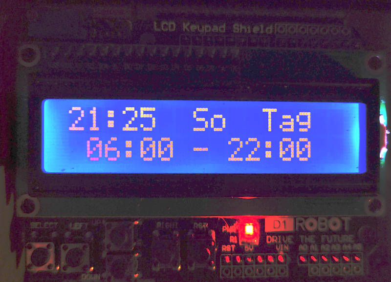

Nachtabsenkung fuer Viessmann Trimatik
--------------------------------------

Da das bestehende Steuergeraet leider einen Defekt hat und daher die
Nachtabsenkung deaktiviert werden musste, wird hier die Nachabsenkung per
simulierter analogen, zeitgesteuerter Fernbedienung umgesetzt.

Das Gerat wird direkt von der Heizung mit Spannung versorgt. Die Uhrzeit und
die Zeit der Nachtabsenkung ist ueber Tasten und Display eingestellbar.

Die Tag- und Nacht-Temperatur wir ueber die verloeteten Widerstaende bestimmt.

In der ersten Zeile zeigt das LCD die aktuelle Uhrzeit and, den aktuellen
Wochentag und den aktuellen Modus (Tag oder Nacht). In der zweiten Zeile wird
der Zeitraum angezeigt, in dem der Tagbetrieb aktiv ist.

Mittels der Tasten unter dem Display ist die Fernbedienung konfigurierbar.
Langes druecken der Select-Taste welchselt in den Konfigurations-Modus.
Kurzes druecken des Select-Taste verlaesst ihn wieder. Mit den Tasten Hoch und
Runter kann der aktuelle Wert (markiert durch einen blinkenden Cursor)
veraendert werden.
Mit den Recht-Links-Tasten wird zwischen den  Werten gewechselt.

Konfiguration der Trimatik
**************************

Vor dem Anschliessen und der Konfiguration an der Zeitschltuhr sollte die
Trimatik-Steurung komplett per Hauptschalter abgeschaltet werden.

In der Zeitschaltuhr muss der Schalter S1.9 auf 1 gestellt werden, wenn die
Fernbedienung benutzt werden soll. Wir die Ferbedienung wieder abgebaut, muss
S1.9 wieder auf 0 gestellt werden.

Die Trimatik selbst wird auf Tagbetrieb gestellt, so dass keine
Tag-/Nacht-Umschaltung mehr von der Trimatik selbst erfolgt.

Der Anschluss der Schaltung selbst erfolgt ueber "Stecker 58", an dem
Fernbedienungen angeschlossen werden.

Hardware
********

Als Basis wurde ein relativ guenstiges, einfach zu beschaffendes
Development-Board ausgewählt. Wichtig dabei ist, dass die Uhrzeit einfach
per RTC gespeichert wird und per Knopfzelle versorgt werden kann. So muss
die Zeit nur sehr selten gestellt werden.

Genutzt werden 3 Platinen:

1. Dev-Board STM32 Nucleo-F446RE
################################

https://docs.zephyrproject.org/latest/boards/arm/nucleo_f446re/doc/index.html

Hier wurde eine Loetbrücke umgesetzt/entfernt um die RTC des STM32 mit einer
Knopfzelle versorgen zu koennen. Zusaetzlich muss ein Jumper umgesetzt
werden, um das Board von aussen ueber einen Pin mit Spannung zu versorgen,
siehe Schaltplan_.

2. LCD und Buttons
##################

Billiges Arduino Shield mit LCD und Buttons https://wiki.dfrobot.com/LCD_KeyPad_Shield_For_Arduino_SKU__DFR0009

Diese Platine wurde nicht veraendert. Die Anbindung der Buttons ueber eine
ADC-Signal ist aber suboptimal.

3. Anbindung an Viessmann-Heizung
#################################

In der Zeitschaltuhr muss der Schalter S1.9 auf 1 gestellt werden, wenn die
Fernbedienung benutzt werden soll. Wir die Ferbedienung wieder abgebaut, muss
S1.9 wieder auf 0 gestellt werden.

Diese Platine ist auf einer Lochraster-Platine aufgebaut und verbindet den
Viessmann "Stecker 58" mit dem Dev-Board.

Vor dem Anschliessen sollte die Trimatik-Steurung komplett abgeschaltet
werden.

Schaltplan_

Der Schaltplan ist noch in Arbeit. Die Platine wird von unten auf die
Stiftleisten des Nucleo-Bords gesteckt.Eine Lochrasteplatine mit
vergleichbarem Aufbau laeuft seit mehreren Monaten.

Bei der Bauteilauswahl ist es wichtig, dass der Vorwiderstand der Optokoppler
zum CTR (der Optokoppler) passen. Ich habe zB einen PC816C benutzt.
Als Mosfet muss ein N-FET benutzt werden, der bei niedrigen Spannungen
durchschaltet und ein niedrigen R_DSON hat, zB der IRML2502.

Ob die Schaltung funktioniert kann nach dem Aufbau mit einen einfachen
Multimeter kontrolliert werden, indem man Im Tag- und im Nacht-Betrieb
den Wiederstand zwischen den beiden entsprechenden Kontakten misst, die
an Stecker 58 angeschlossen werden.

Spannungsversorgung
~~~~~~~~~~~~~~~~~~~

Die Spannungsversorgung erfolgt auch aus dem "Stecker 58" und wird per
Schaltregler-Platine an den Spannungseingang vom Dev-Board angelegt. Da keine
Relais versorgt werden muessen, ist der Strombedarf recht gering (ich glaube
es war max 100mA). Der groesste Verbraucher ist die Hintergrundbeleuchtung
des LCD. Die ist nur aktiv, wenn das Geraet bedient wird oder neu startet.

Analoge Fernbedienung
~~~~~~~~~~~~~~~~~~~~~

Die Heizungssteuerung besitzt einen Eingang fuer eine analoge Fernbedienung.
Ueber den Widerstand, den die Heizungssteuerung zwischen 2 Pins sieht, stellt
sie die Soll-Temperatur ein. Dabei ist der Widerstand sehr grob zwischen 200
und 300 Ohm. Bei der vorhandenen Heizung fliessen ca 5mA Strom durch den
Widerstand.

Anders als in den u.g. Projekten wird hier der Widerstandswert nicht per Relais
geandert, sondern per Optokoppler und Mosfet, so dass die Schaltung robuster
sein sollte und weniger Strom benoetigt wird. Wie bei der Relais-Schaltung
ist auch diese Widerstands-Schaltung galvanisch getrennt vom Rest.

Folgende Widerstandswerte (fuer hohe Temperaturen) habe ich in
meinem Prototypen benutzt:

+-------------+-------------------+-------------+
| Modus       | Gesamt-Widerstand | Temperatur  |
+-------------+-------------------+-------------+
| Tag         | 300 Ohm           | ca 22 °C    |
+-------------+-------------------+-------------+
| Nacht       | 283 Ohm           | ca 17 °C    |
+-------------+-------------------+-------------+
| Frostschutz | 270 Ohm           | ca 11 °C    |
+-------------+-------------------+-------------+

Die Widerstandswerte sind aus der Grafik in fuer den Tagbetrieb
(der ja jetzt an der Heizungssteuerung selbst immer aktiv ist)
https://homematic-forum.de/forum/viewtopic.php?t=22719&start=10#p203286
Der Modus Frostschutz ist nicht umgesetzt.

Die Schaltung ist so umgesetzt, dass die Heizung im Tagbetrieb ist, wenn das
Development-Board nicht aufgesteckt ist bzw der Mikrokontroller keinen
Modus aktiv waehlt.

Firmware
********

Die Firmware nutzt zephyr https://www.zephyrproject.org/ und basiert teilweise
auf dem HD44780 sample.

Die Firmware kann auch einfach auf andere STM32-basierte Boards angepasst
werden. Für andere Controller ist etwas mehr Aufwand notwendig, da der
RTC-Treiber angepasst werden muss.

Der Code ist nicht besonders aufgeraeumt, dokumentiert oder strukturiert. Der
Schwerpunkt bei der Entwicklung lag darin in einer kurzen Zeit das o.g.
Problem zu loesen. Da die Tasten an einem ADC-Eingang angeschlossen sind,
werden diese gepollt.

Um das Projekt zu compilieren und zu flashen, wird die Toolchain etc von zephyr
benoetigt, siehe  https://docs.zephyrproject.org/latest/getting_started/index.html

Diese Befehle beziehen sich auf Linux, unter Windows sind sie ein wenig anders.

Installation von west https://docs.zephyrproject.org/latest/guides/west/index.html
::

   $ pip3 install --user -U west

Abrufen des Quellcodes (inklusive zephyr etc)::

   $ cd <project dir>
   $ mkdir nachabsenkung
   $ cd nachabsenkung
   $ west init -m https://github.com/chrta/nachtabsenkung_trimatik.git
   $ west update

Compilieren und Flashen::

  $ cd <project dir>/nachabsenkung
  $ cd application
  $ source ../zephyr/zephyr-env.sh
  $ west build -b 
  $ west flash

Aktualisieren, falls es eine neue Version im git gibt::

  $ cd <project dir>/nachabsenkung
  $ git pull
  $ west update

Es sollte auch moeglich sein das Projekt mittels PlattformIO zu uebersetzen:
https://docs.platformio.org/en/latest/frameworks/zephyr.html

Links
*****

Die Idee fuer dieses Projekt habe ich mir von anderen Projekten abgeguckt,
vor allem
https://homematic-forum.de/forum/viewtopic.php?f=27&t=22719 und
https://www.haustechnikdialog.de/Forum/t/112714/Viessmann-Fernbedienungsgeraet-WS-RS-Schaltplan

Vielen Dank allen, die Informationen veroeffentlicht haben und sich an den
Diskussionen beteiligt haben.

Lizenz
******

Wenn nicht anders im Quellcode angegeben steht das gesamte Projekt unter
Apache 2.0 siehe https://www.apache.org/licenses/LICENSE-2.0

Copyright 2020 Christian Taedcke

Licensed under the Apache License, Version 2.0 (the "License");
you may not use this file except in compliance with the License.
You may obtain a copy of the License at

    http://www.apache.org/licenses/LICENSE-2.0

Unless required by applicable law or agreed to in writing, software
distributed under the License is distributed on an "AS IS" BASIS,
WITHOUT WARRANTIES OR CONDITIONS OF ANY KIND, either express or implied.
See the License for the specific language governing permissions and
limitations under the License.

.. _Schaltplan: hw/stm32_viessman_remote.pdf
